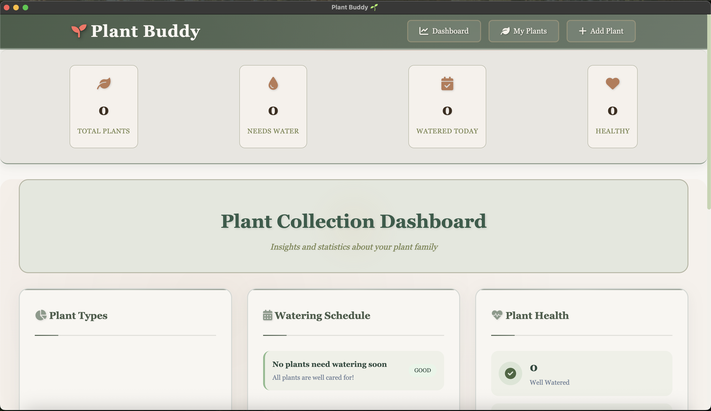

# Plant Buddy 🌱

A beautiful, cozy plant watering tracker app built with Electron. Keep track of your plant collection and never forget to water them again!

---

## 📸 Screenshots

| Dashboard Overview | Empty State | Quick Actions & Stats |
|-------------------|-------------|----------------------|
|  |  |  |

**Add Plant Modal:**


---

## 🚀 Quick Start

### Prerequisites
- Node.js (version 14 or higher)
- npm or yarn

### Installation
1. **Clone the repository**
   ```bash
   git clone <repository-url>
   cd plant-buddy
   ```
2. **Install dependencies**
   ```bash
   npm install
   ```
3. **Start the app**
   ```bash
   npm start
   ```

---

## 🛠️ Building for Distribution

To create a distributable version of the app:
```bash
npm run build
```

### Packaging for Windows (Important!)
- **On macOS:** Building a Windows `.exe` requires Wine. On Apple Silicon, this is complex and may not work due to missing `wine64`. The recommended way is to build on a real Windows machine or use a cloud CI (like GitHub Actions).
- **On Windows:**
  ```bash
  npx electron-packager . "Plant Buddy" --platform=win32 --arch=ia32 --icon=assets/electron.ico --overwrite
  ```
- **On macOS:**
  ```bash
  npx electron-packager . "Plant Buddy" --platform=darwin --arch=x64 --icon=assets/electron.icns --overwrite
  ```

---

## 🧹 Cleaning Up Before Publishing
- Delete all `.DS_Store` files (macOS metadata)
- Remove `tmp-svg2png/` and `assets/PlantBuddy.iconset/` if not needed
- Only keep necessary assets (icons, images used in the app)

---

## Features

### 🌿 Plant Management
- **Add Plants**: Easily add new plants to your collection with custom names, types, and watering schedules
- **Plant Types**: Categorize plants as Succulent, Tropical, Herb, Flowering, Cactus, or Other
- **Custom Notes**: Add special care instructions and notes for each plant
- **Watering Schedules**: Set custom watering frequencies for each plant (1-30 days)

### 💧 Watering Tracking
- **Visual Progress**: See at a glance which plants need water with color-coded progress bars
- **Smart Alerts**: Plants that need water are highlighted with a pulsing animation
- **Water History**: Track when each plant was last watered
- **One-Click Watering**: Mark plants as watered with a single click

### 📊 Dashboard
- **Statistics**: View total plants, plants needing water, and plants watered today
- **Beautiful Cards**: Each plant is displayed in an elegant card with all essential information
- **Responsive Design**: Works perfectly on desktop and mobile devices

### 🎨 Cozy Design
- **Warm Color Palette**: Soft gradients and earthy tones for a comfortable experience
- **Smooth Animations**: Delightful hover effects and transitions
- **Modern UI**: Clean, intuitive interface with beautiful typography
- **Plant Icons**: Lovely plant-themed icons throughout the app

## How to Use

### Adding Your First Plant

1. Click the **"Add Plant"** button in the header
2. Fill in the plant details:
   - **Plant Name**: Give your plant a name (e.g., "Monstera Deliciosa")
   - **Plant Type**: Select the appropriate category
   - **Watering Frequency**: Set how often the plant needs water (in days)
   - **Last Watered**: Set when you last watered the plant
   - **Notes**: Add any special care instructions (optional)
3. Click **"Add Plant"** to save

### Managing Your Plants

- **View Details**: Click on any plant card to see detailed information
- **Water Plant**: Click the water button in the plant details to mark as watered
- **Delete Plant**: Remove plants from your collection (with confirmation)
- **Track Progress**: Monitor watering progress with visual progress bars

### Understanding the Interface

- **Green Progress Bars**: Plants that are well-watered
- **Red Progress Bars**: Plants that need water (with pulsing animation)
- **Status Badges**: "Watered" or "Needs Water" indicators
- **Statistics Bar**: Overview of your plant collection at the top

## Data Storage

Your plant data is automatically saved to your computer's local storage, so it persists between app sessions. No internet connection required!

## Customization

### Adding Sample Plants

To add some example plants for testing, uncomment the last line in `app.js`:

```javascript
// Uncomment the line below to add sample plants for testing
addSamplePlants();
```

### Styling

The app uses a warm, cozy color palette with:
- **Primary Colors**: Purple gradients (#667eea to #764ba2)
- **Accent Colors**: Green (#68d391) for healthy plants, red (#f56565) for plants needing water
- **Background**: Soft gradient from light blue to lavender
- **Typography**: Inter font family for clean, modern text

## Technical Details

- **Framework**: Electron for cross-platform desktop app
- **Frontend**: Vanilla JavaScript with modern ES6+ features
- **Styling**: CSS3 with Flexbox and Grid layouts
- **Storage**: LocalStorage for data persistence
- **Icons**: Font Awesome for beautiful plant-themed icons

## Future Features

- [ ] Plant photos and image upload
- [ ] Fertilizer tracking
- [ ] Repotting reminders
- [ ] Plant health monitoring
- [ ] Export/import plant data
- [ ] Cloud sync
- [ ] Plant care tips and guides
- [ ] Seasonal adjustments for watering schedules

## Contributing

Feel free to contribute to this project! Some areas that could use improvement:
- Adding more plant types and care instructions
- Implementing the edit plant functionality
- Adding plant photos
- Creating a mobile companion app

## License

This project is open source and available under the [MIT License](LICENSE).

---

**Happy Plant Parenting! 🌱💚**

*Built with love for plant enthusiasts everywhere.* 